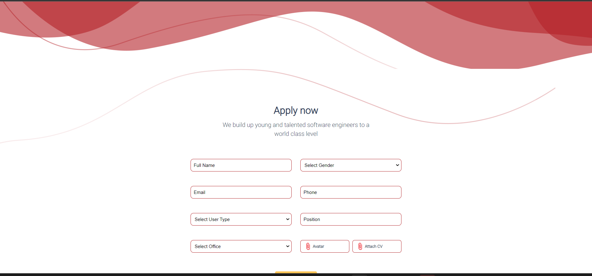
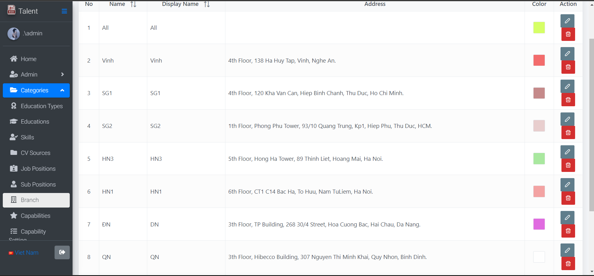

#  TALENT

## Overview
Talent Management is the solution to support companies’ recruitment. It helps to store recruitment campaign information, update recruitment progress, recruitment requests, manage candidate information & application history, plan interview schedule, and report interview result

 ## Table of Contents

- [Getting Started](#getting-started)
  - [Prerequisites](#prerequisites)
  - [Backend Setup](#backend-setup)
  - [Frontend Setup](#frontend-setup)
  - [Building](#building)
  - [Running](#running)
- [Screenshorts](#screenshots)
- [License](#license)
  + Front-end: Angular.
  + Back-end: ASP.NET Core (C#).
  + Cơ sở dữ liệu: PostgreSQL. 
## Getting Started
### Prerequisites
Before you begin, ensure you have met the following requirements:

- [Visual Studio 2022](https://visualstudio.microsoft.com/) installed.
- [.NET Core 6.0 SDK](https://dotnet.microsoft.com/en-us/download/dotnet/6.0) installed.
- [Visual Studio Code](https://code.visualstudio.com/) installed
- [Node.js 16.16](https://nodejs.org/en/blog/release/v16.16.0) and npm (Node.js Package Manager) installed.
- [PostgreSQL](https://www.postgresql.org/) installed.
### Backend Setup
1. **Create a folder** to store the backend and frontend code.
- example:  folder `Talent`

2. **Open a command prompt** in the created folder.

3. **Clone the backend repository** using the following command:
   ```bash
   git clone https://github.com/ncc-erp/ncc-erp-talent-v2
   ```
4. Open the backend solution using **Visual Studio 2022**:
- Launch `Visual Studio 2022`.
- Select `File` > `Open` > `Project/Solution.`
- Navigate to the backend folder within created folder `Talent` and open the solution file.
5. Restore NuGet packages:
- In Solution Explorer, right-click the solution and select **Restore NuGet Packages**.

6. **Set the startup project:**
- Right-click the desired project (usually the API project) in `Solution Explorer`.
Select **Set as StartUp Project**.

7. Connect with PostgreSQL:

   vd: "User ID=...;Password=...;Host=localhost;Port=...;Database=..;Pooling=true;"

8. Update the `appsettings.json` file:
- Open the `appsettings.json` file in the backend project.
- Locate the `ConnectionStrings` section.
- Update the **Default** connection string to match your local database information:
```json
{
  "ConnectionStrings": {
    "Default": "User ID=...;Password=...;Host=localhost;Port=5432;Database=dev_talentv2;Pooling=true;""
  },
  // ... other settings ...
}
```
9. Press `F5` or select `Debug` > `Start Debugging` to run the backend.
### Frontend Setup
1.Open Front-end repository
```bash
cd ..\ncc-erp-talent\angular
```
2.Install Angular CLI: 12.2.16 globally:
```bash
npm install -g @angular/cli@12.2.16
```
3.Install frontend dependencies:
```bash
npm install 
```
4.Run front-end
```bash
npm start
```
### Building
To build the project, follow these steps:

1.Build the backend using `Visual Studio Code` or the `command line`.

2.Build the frontend:
```bash
npm run build
```
### Running

1.Start the backend using `Visual Studio Code` or the `command line`.

2.Start the frontend:
```bash
npm start
```
# Screenshots
 - Page send CV.
 
- Page Login  

- Page create ures

 - Page home.

 - Page Address

- Page Candiate 

# License