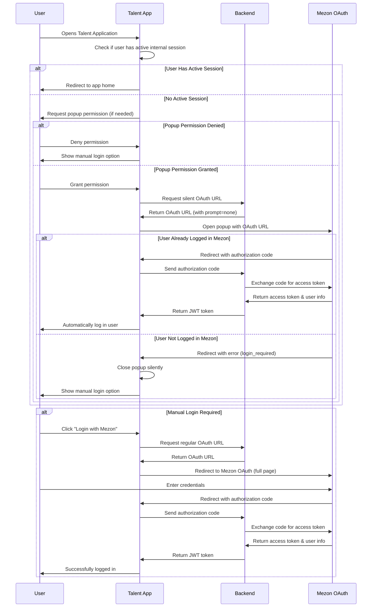

# Silent Authentication Flow Documentation

## Overview

The silent authentication system allows automatic user login through Mezon OAuth without requiring explicit user interaction. This document describes the popup-based implementation that replaced the original iframe approach due to CSP (Content Security Policy) restrictions.

## Sequence Diagram



## Process Flow Breakdown

### 1. Application Initialization

```pseudocode
STEP 1: App Startup
  CHECK if user has active internal session
    IF session_exists AND session_valid THEN
      redirect_to_app_home
      EXIT // Skip silent auth flow
    ELSE
      proceed_to_silent_auth_check
    END IF
```

**Purpose**: Automatically attempt login when application loads, avoiding redundant checks.

### 2. Permission Management Flow

```pseudocode
STEP 2: Popup Permission Check
  TRY create test popup
    IF popup created successfully THEN
      close test popup
      return permission_granted
    ELSE
      return permission_denied
    END IF
  CATCH popup_blocked
    return permission_denied
  END TRY

STEP 3: Request User Permission
  SHOW dialog "Enable automatic login?"
  WAIT for user response
  RETURN user_choice
```

**Purpose**: Ensure popup functionality works before attempting authentication.

### 3. Silent Authentication Process

```pseudocode
STEP 4: Silent Auth Attempt
  GET silent_oauth_url FROM backend
  OPEN popup_window WITH silent_oauth_url
  SET timeout = 30_seconds
  
  LISTEN FOR messages FROM popup
    IF message.type = "auth_success" THEN
      EXTRACT authorization_code
      CALL backend.authenticate(code)
      CLOSE popup
      REDIRECT to application
    ELSE IF message.type = "auth_error" THEN
      LOG error
      CLOSE popup
      SHOW manual_login_option
    END IF
  END LISTEN
  
  IF timeout_reached THEN
    CLOSE popup
    SHOW manual_login_option
  END IF
```

**Purpose**: Attempt authentication without user interaction using existing Mezon session.

### 4. Backend OAuth URL Generation

```pseudocode
STEP 5: Generate Silent OAuth URL
  base_url = mezon_oauth_endpoint
  parameters = {
    client_id: app_client_id,
    redirect_uri: callback_url,
    response_type: "code",
    scope: "openid offline",
    prompt: "none"  // KEY: Silent mode
  }
  RETURN base_url + parameters
```

**Key Parameter**: `prompt=none` instructs Mezon to return error instead of showing login form.

#### JavaScript Example - Full Silent OAuth URL Structure
```javascript
// Example of what the backend generates for silent OAuth
const silentOAuthUrl = "https://api.mezon.vn/oauth2/auth?" +
  "client_id=your_app_client_id&" +
  "redirect_uri=https%3A%2F%2Fyour-app.com%2Faccount%2Fauth-callback&" +
  "response_type=code&" +
  "scope=openid+offline&" +
  "state=abc123def45&" +
  "prompt=none";

// Frontend usage in popup
const popup = window.open(
  silentOAuthUrl,
  'mezon-silent-auth',
  'width=500,height=600,scrollbars=yes,resizable=yes'
);

// Expected responses from Mezon:
// Success: https://your-app.com/account/auth-callback?code=AUTH_CODE&state=abc123def45
// Error:   https://your-app.com/account/auth-callback?error=login_required&state=abc123def45
```

### 5. Popup Window Management

```pseudocode
STEP 6: Popup Handling
  CREATE popup_window WITH:
    - restricted permissions (no toolbar, menubar)
    - fixed size (500x600)
    - OAuth URL destination
  
  MONITOR popup_status:
    - message_received
    - window_closed
    - timeout_reached
  
  CLEANUP resources:
    - close popup if open
    - remove event listeners
    - clear timeouts
```

**Purpose**: Secure, controlled environment for OAuth flow with automatic cleanup.

### 6. Authentication Callback Processing

```pseudocode
STEP 7: Handle OAuth Response
  IF running_in_popup THEN
    EXTRACT auth_code OR error FROM url_parameters
    SEND message TO parent_window:
      type: "mezon_silent_auth"
      code: auth_code
      error: error_message
    CLOSE popup_window
  ELSE
    // Regular authentication flow
    PROCESS auth_code normally
  END IF
```

**Purpose**: Route authentication results back to main application window.

## State Management

### Authentication States

1. **Not Checked**: Initial state when application loads
2. **Checking**: Permission verification and popup opening in progress
3. **Permission Denied**: User declined popup permission
4. **Authentication Failed**: Mezon OAuth returned error (user not logged in)
5. **Authentication Success**: Valid token received and user logged in
6. **Popup Blocked**: Browser blocked popup window
7. **Timeout**: Authentication process exceeded timeout limit

### Error Handling

| Error Type | Description | User Action |
|------------|-------------|-------------|
| `popup_permission_denied` | User declined popup permission | Manual login required |
| `popup_blocked` | Browser blocked popup | Enable popups and retry |
| `timeout` | OAuth process exceeded 30 seconds | Check network and retry |
| `api_error` | Backend service error | Contact support |
| `oauth_error` | Mezon OAuth server error | Retry or manual login |

## Security Measures

### 1. Origin Validation
```pseudocode
FOR each message received
  IF message.origin != current_domain THEN
    reject_message
  ELSE
    process_message
  END IF
END FOR
```

### 2. Message Type Validation
```pseudocode
IF message.type != "mezon_silent_auth" THEN
  ignore_message
ELSE
  process_authentication_data
END IF
```

### 3. Popup Restrictions
- **Minimal Permissions**: No access to browser features
- **Time Limits**: Automatic closure after 30 seconds
- **Size Constraints**: Fixed dimensions prevent misuse
- **Domain Validation**: Only accepts messages from same origin

### 4. Timeout Protection
```pseudocode
SET timer = 30_seconds
IF authentication_not_complete_before_timeout THEN
  close_popup
  cleanup_resources
  show_manual_login
END IF
```

## Performance Strategy

### 1. Single Execution Protection
```pseudocode
IF silent_auth_already_attempted OR user_already_logged_in THEN
  skip_silent_auth
ELSE
  mark_as_attempted
  proceed_with_silent_auth
END IF
```

### 2. Resource Management
```pseudocode
ON authentication_complete OR timeout OR error:
  close_popup_window
  remove_event_listeners
  clear_timers
  cleanup_memory
END ON
```

### 3. Efficient Permission Testing
```pseudocode
CREATE minimal_hidden_popup
IF popup_created_successfully THEN
  close_immediately
  return_permission_granted
ELSE
  return_permission_denied
END IF
```

## Migration from Iframe Approach

### Original Iframe Issues

1. **CSP Restrictions**: `frame-ancestors` directive blocked iframe embedding
2. **Cross-Origin Limitations**: Limited communication between iframe and parent
3. **User Experience**: Hidden iframes provided no visual feedback

### Popup Solution Benefits

1. **CSP Compliance**: Popups not restricted by `frame-ancestors`
2. **User Visibility**: Clear indication of authentication process
3. **Permission Control**: Users can manage popup permissions
4. **Better Error Handling**: More robust communication via postMessage

## Testing Scenarios

### 1. Happy Path
- User is already authenticated in Mezon
- Popup permission granted
- Silent authentication succeeds
- User automatically logged in

### 2. User Not Authenticated
- User not logged into Mezon
- Popup shows "permission denied" error
- Silent auth fails gracefully
- User can proceed with manual login

### 3. Popup Permission Denied
- User declines popup permission
- System falls back to manual login
- No silent authentication attempted

### 4. Network Issues
- Timeout after 30 seconds
- Popup closes automatically
- User notified of failure
- Manual login available

## Configuration Parameters

### Frontend Settings
```pseudocode
POPUP_CONFIGURATION:
  width: 500px
  height: 600px
  features: minimal_browser_chrome
  position: center_screen

TIMING_CONFIGURATION:
  authentication_timeout: 30_seconds
  popup_close_delay: 1_second
  permission_test_duration: instant
```

### Backend Settings
```pseudocode
MEZON_OAUTH_CONFIG:
  client_id: registered_app_id
  client_secret: secure_app_secret
  redirect_uri: application_callback_url
  
SILENT_AUTH_PARAMETERS:
  base_oauth_url + "&prompt=none"
  response_type: "code"
  scope: "openid offline"
```

## Future Enhancements

1. **Retry Mechanism**: Automatic retry on temporary failures
2. **Better UX**: Loading indicators and progress feedback
3. **Analytics**: Track silent auth success rates
4. **Caching**: Cache permission status to reduce redundant checks
5. **Mobile Support**: Optimize popup behavior for mobile devices

## Troubleshooting

### Common Issues

1. **Popup Blocked**: Enable popups in browser settings
2. **Silent Auth Fails**: Check if user is logged into Mezon
3. **Permission Dialog**: Ensure ABP framework is properly configured
4. **Timeout Issues**: Check network connectivity and Mezon service status

### Debug Information

Enable browser console logging to see detailed flow information:
- Permission check results
- Popup window creation status
- PostMessage communication
- Authentication API responses
- Error details and stack traces